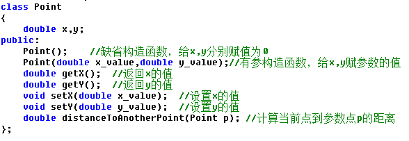

# 问题A：Point(类与对象)

## 题目描述
下面是一个平面上的点的类定义，请在类外实现它的所有方法，并生成点测试它。



## 输入
测试数据的组数 t

第一组测试数据点p1的x坐标   第一组测试数据点p1的y坐标  第一组测试数据点p2的x坐标   第一组测试数据点p2的y坐标

..........

## 输出
输出p1到p2的距离

在Java中，输出指定精度的参考代码如下：

```Java
public static void main(String[] args)
{ 
  double a =3.141596;
  System.out.println("%,.3f", a);  //输出小数点后3位
}
```

## 样例输入
```Text
2
1 2 3 4
-1 0.5 -2 5
```

## 样例输出
```Text
Distance of Point(1.00,2.00) to Point(3.00,4.00) is 2.83
Distance of Point(-1.00,0.50) to Point(-2.00,5.00) is 4.61
```